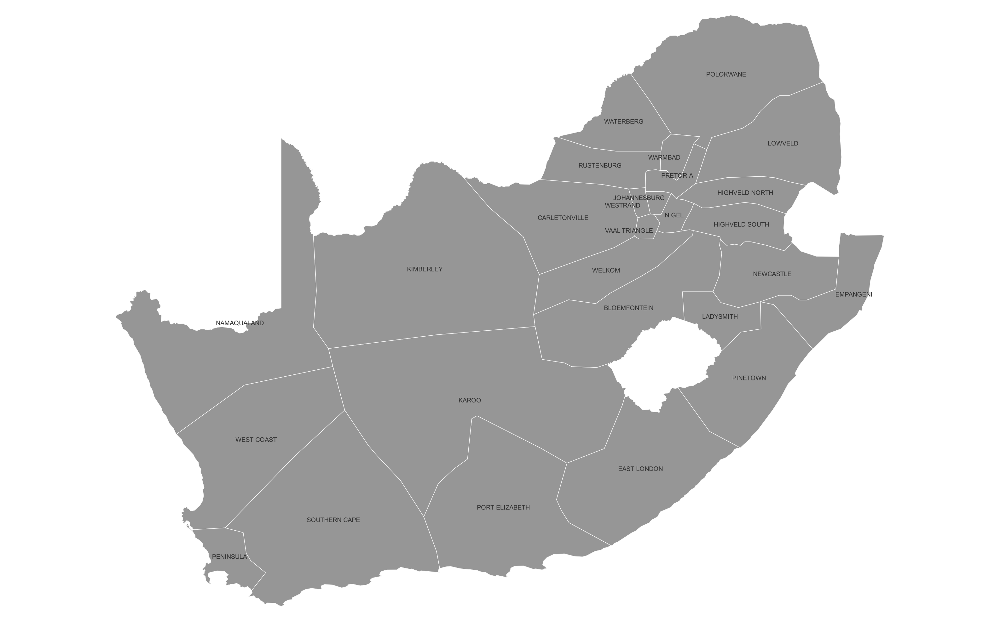

# PyPSA-ZA: An open Optimisation Model of the South African Power System
The accelerating development of open-source energy system modelling tools in recent years has now reached the point where it opens up a credible alternative approach to closed source exclusivity. An ever increasing number of studies are demonstrating that it is possible to produce analysis of a high quality using open-source energy system models, whilst building a wider participating modelling community. This builds confidence in results by enabling more effective peer review of work and therefore more effective feedback loops. It also builds a consistent stream of new talent entering the space to ensure that energy sector analytical capacity can be retained and steadily expanded.

PyPSA-ZA is an open energy model of the South African power system that can be utilised for both operational studies and generation and transmission expansion planning studies. PyPSA-ZA is built upon the the open toolbox [PyPSA](https://pypsa.org/) for which [documentation is available](https://pypsa.readthedocs.io/en/latest/index.html).

This model makes use of freely available and open data which encourages the open exchange of model data developments and eases the comparison of model results. It provides a full, automated software pipeline to assemble the load-flow-ready model from the original datasets, which enables easy replacement and improvement of the individual parts.

PyPSA-ZA has been designed to conduct capacity expansion planning studies at differing spatial and temporal resolutions. 
Three different spatial resolutions are available in the model:

- ``1-supply``: A single node for the entire South Africa.
- ``11-supply``: 11 nodes based on the [Eskom Generation Connection Capacity Assessment of the 2024 Transmission Network (GCCA – 2024)](https://www.eskom.co.za/eskom-divisions/tx/gcca/) regions.
- ``27-supply``: 27 nodes based on Eskom 27 supply regions as per the original PyPSA-ZA model.




PyPSA-ZA can be solved for a single year, or for multiple years, with perfect foresight.
Multi-horizon capacity expansion planning is compuationally intensive, and therefore 
the spatial resolution will typically need to be reduced to ``1-supply`` or ``11-supply``
depending on the number of years modelled. By defualt PyPSA-ZA uses full chronology
(8760h per year), but the number of snapshots can be reduced through the use of time-series 
segmentation through the open-source [Time Series Aggregation Module]( https://github.com/FZJ-IEK3-VSA/tsam/). 

This project is currently maintained by [Meridian Economics]( https://meridianeconomics.co.za/). Previous versions were developed within the Energy Centre 
at the [Council for Scientific and Industrial Research (CSIR)](https://www.csir.co.za/) as part of the [CoNDyNet project](https://fias.institute/en/projects/condynet/), which is supported by the 
[German Federal Ministry of Education and Research](https://www.bmbf.de/bmbf/en/home/home_node.html) under grant no. 03SF0472C. 

The model is currently under development and has been validated for the single node (`1-supply`), for more information on the capability of the moel please see the [documentation](https://pypsa-za.readthedocs.io/en/latest/). 


**NOTE**
   
  Credits to Jonas Hörsch and Joanne Calitz who developed the original [PyPSA-ZA model](https://arxiv.org/pdf/1710.11199.pdf), 
  [Meridian Economics](http://meridianeconomics.co.za) who extended the PyPSA-ZA model.
  PyPSA-ZA is relies on a number of functions from the [PyPSA-Eur](https://github.com/PyPSA/pypsa-eur) and [PyPSA-Meets-Earth](https://github.com/pypsa-meets-earth/pypsa-earth).


<!---
## Instructions

To build and solve the model, a computer with about 20GB of memory with a strong
interior-point solver supported by the modelling library
[PYOMO](https://github.com/Pyomo/pyomo) like Gurobi or CPLEX are required.

We recommend as preparatory steps (the path before the `%` sign denotes the
directory in which the commands following the `%` should be entered):

1. cloning the repository using `git` (**to a directory without any spaces in the path**)
   ```shell
   /some/other/path % cd /some/path/without/spaces
   /some/path/without/spaces % git clone https://github.com/FRESNA/pypsa-za.git
   ```

2. installing the necessary python dependencies using conda (from within the `pypsa-za` directory)
   ```shell
   .../pypsa-za % conda env create -f environment.yaml
   .../pypsa-za % source activate pypsa-za  # or conda activate pypsa-za on windows
   ```

3. getting the separate [data bundle](https://vfs.fias.science/d/f204668ef2/files/?p=/pypsa-za-bundle.7z&dl=1) (see also [Data dependencies] below) and unpacking it in `data`
   ```shell
   .../data % wget "https://vfs.fias.science/d/f204668ef2/files/?dl=1&p=/pypsa-za-bundle.7z"
   .../data % 7z x pypsa-za-bundle.7z
   ```

All results and scenario comparisons are reproduced using the workflow
management system `snakemake`
```shell
.../pypsa-za % snakemake
[... will take about a week on a recent computer with all scenarios ...]
```

`snakemake` will first compute several intermediate data files in the directory
`resources`, then prepare unsolved networks in `networks`, solve them and save
the resulting networks in `results/version-0.x/networks` and finally render the
main plots into `results/version-0.5/plots`.

Instead of computing all scenarios (defined by the product of all wildcards in
the `scenario` config section), `snakemake` also allows to compute only a
specific scenario like `csir-aggressive_redz_E_LC`:
```shell
.../pypsa-za % snakemake results/version-0.5/plots/network_csir-aggressive_redz_E_LC_p_nom
```
--->
