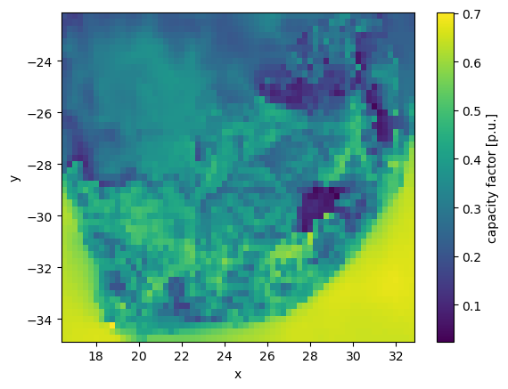

..
  SPDX-FileCopyrightText: 2021 The PyPSA meets Earth authors

  SPDX-License-Identifier: CC-BY-4.0

.. _data_workflow:

##########################################
Data used by the model
##########################################

This section explains in detail how PyPSA-ZA downloads and retrieves the various data types.

Preparing the power grid layout and climatic inputs are two essential aspects of the energy modelling workflow. In addition, PyPSA-ZA utilises several environmental, economic, and technological datasets.

1. Grid topology data
===================================

PyPSA-ZA allows the user to select the desired spatial resolution; shape files are presently available for South Africa, the nine provinces of South Africa, the ten supply areas outlined in the Eskom TDP, and the twenty-seven Eskom supply regions.
These shape files may be found in `data/bundle/supply regions/regions.shp`, where `regions` represents the desired spatial resolution, such as `10-supply`.

The grid topology model is constructed using the `build_topology` rule. When the rule `build_topology` is executed, the buses and lines are computed and saved as geojson files in the folders `resources/buses_{regions}.geojson` and `resources/lines_{regions}.geojson` for each region.

2. Climate data
===================================

The climate data processing is provided by the `atlite <https://atlite.readthedocs.io/en/latest/>`_ package and `GWA <https://globalwindatlas.info/en/area/South%20Africa>`_.

The `build_cutout` rule downloads weather data from either `ERA5 <https://www.ecmwf.int/en/forecasts/datasets/reanalysis-datasets/era5>`_ reanalysis weather dataset or `SARAH-2 <https://wui.cmsaf.eu/safira/action/viewProduktSearch>`_
satellite-based historic weather data. It extracts all the required whether and climate data to generate the time series of renewable potential by `build_renewable_profiles` rule. 

The rule `build_renewable_profiles` corrects for the wind speed at 100m using `GWA <https://globalwindatlas.info/en/area/South%20Africa>`_ data which is provided in `data/bundle/ZAF_wind-speed_100m.tif`.

3. General data
===================================

There are a number datasets applied in PyPSA-ZA to build a realistic model. Original datasets are stored in the `data/bundle` folder. Currently we are using the following resources.

Environmental
------------------------------------

* **SAPAD** The South African Protected Areas Database (SAPAD)  

.. image:: img/copernicus.png
    :height: 150 px
    :align: center

It is used in the `build_natura_raster` rule to quantify what are the land regions available for the installation of renewable resources, e.g. renewable assets may not be installed on arable land. 

* **SACAD** The South African Conservation Areas Database (SACAD)  

.. image:: img/copernicus.png
    :height: 150 px
    :align: center

It is used in the `build_natura_raster` rule to quantify what are the land regions available for the installation of renewable resources, e.g. renewable assets may not be installed on arable land

* **redz** A dataset of the Renewable Energy Development Zones (REDZs) containing 8 priority areas for investment of wind and solar PV development available from the `Department of Forestry, Fishers and the Environment <https://egis.environment.gov.za/redz>`_ of the Republic of South Africa.

The dataset is used to restrict renewable energy expansion to the REDZs regions in the rule `build_renewable_profiles`.

* **corridors** A dataset of REDZs Strategic Transmission Corridors containing 5 priority areas for the investement of new 
electricity transmission and distribution infrustructure available from the `Department of Forestry Fishers and the Environment <https://egis.environment.gov.za/egi>`_

The dataset is used to restrict renewable energy expansion to the strategic transmission corridors regions in the rule `build_renewable_profiles`.

.. image:: img/gebco_2021_grid_image.jpg
    :width: 150%
    :align: center

* **salandcover** A dataset of the `South African National Land Cover <https://egis.environment.gov.za/sa_national_land_cover_datasets>`_

Economical
------------------------------------

* **costs.csv** spreadsheet in `model_file.xlsx` file which contains the default costs of the technologies along with their typical lifetime and efficiency values. The dataset is intended to give a starting point for running the model while user specific adjustments may be made. 

* **ZAF15adjv4.tif** raster dataset of the population located in `data/bundle/South_Africa_100m_Population/ZAF15adjv4.tif`

Technological
------------------------------------

* **EIA_hydro_generation_2011_2014.csv** contains data on total energy production of existing plants as reported per country by the open US Energy Information Administration `EIA platforms <https://www.eia.gov/international/data/world>`_. It is used to calibrate the runoff time series obtained from the global reanalysis data.

4. Pre-calculated datasets
===================================

There are some datasets which were prepared to ensure smooth run of the model. However, they may (and in some cases) must be replaced by custom ones. 

* **natura.tiff** contains geo-spatial data on location of protected and conservation areas and may be used as mask the exclude such areas when calculating the renewable potential by `build_renewable_profiles` rule. The `natura` flag in the configuration file allows to switch-on this option while presence of the `natura.tiff` in the `resources` folder is needed to run the model. 

Currently the pre-build file is calculated for South Africa using the `SAPAD` and `SACAD` datasets. 

* **SystemEnergy2009_22.csv** is the electricity demand profile provided from the Eskom data portal. This pre-downloaded data on electricity demand is placed in `data/bundle/SystemEnergy2009_22.csv`.

* **eskom_pu_profiles.csv** is Eskom hourly pu profiles for all wind and solar generators in South Africa. The `use_eskom_wind_solar` flag in the configuration file allows to switch-on this option. This data is located in `data/eskom_pu_profiles.csv`

* **num_lines.xlsx** is the number of high voltage transmission lines (i.e 275kV, 400kV and 765kV) between neighbouring regions. 

* **Eskom EAF data.xlsx** is daily Energy Availability Factor of `Eskom <https://www.eskom.co.za/dataportal/>`_ plants. It is the difference between the maximum availability and all unavailabilities (PCLF, UCLF & OCLF) expressed as a percentage. This excludes renewables, IPPs and international imports. This  pre-downloaded data is placed in `data/Eskom EAF data.xlsx`

5. Scenario generation spreadsheet
===================================
model_file="model_file.xlsx",

