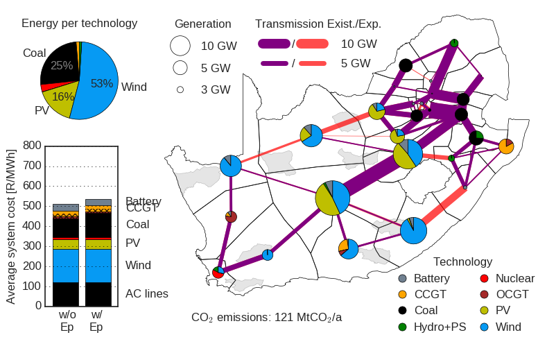

.. pypsa-za documentation master file, created by
   sphinx-quickstart on Fri Jan  6 10:47:23 2023.
   You can adapt this file completely to your liking, but it should at least
   contain the root `toctree` directive.

PyPSA-ZA: An open Optimisation Model of the South African Power System
=======================================================================

An initial PyPSA-ZA model of the South African power system called was developed by `Hörsch 
and Calitz <https://arxiv.org/pdf/1710.11199.pdf>`_ who studied a future renewable energy based 
South African electricity network for a single reference year (in other words, it was not an 
intertemporally optimised power system development model – showing an optimised transition 
over time – it only provided a snapshot of an optimised high renewables system at a particular 
point in time – 2040, albeit with reasonable spatial (network) resolution.

The PyPSA-ZA model has been designed to handle high spatial resolution 
(detailed network specification, i.e. grid constraints), but it does not perform multi-year 
optimisation and instead analyses a single year snapshot. Currently, there is no existing PyPSA model 
for South Africa that can be used to address the multi-year, least cost optimised, transition path to 
a decarbonised power sector over the coming decades. Therefore, an updated and expanded PyPSA-ZA model 
is required that is comparable with the existing, mostly proprietary, modelling approaches that are 
used in the country. 

Although the experience from `PyPSA-Eur <https://github.com/PyPSA/pypsa-eur>`_, PyPSA-ZA and 
`PyPSA meets Earth <https://pypsa-meets-earth.github.io/>`_ has be leveraged to significantly shorten 
the development timeframe for the new model, there remains extensive work that is required in terms 
of input datasets, model development, and validation against existing results from commercial 
tools to establish its credibility to ensure that the outcomes can be trusted to support policy decisions.

.. PyPSA model of the South African electricity system at the level of ESKOM's supply regions.
   The model is described and evaluated in the paper PyPSA-ZA: Investment and operation co-optimization of integrating wind and solar in South Africa at high spatial and temporal detail, 2017, arXiv:1710.11199. 
   This repository contains the scripts to automatically reproduce the analysis.

=============
Documentation
=============

**Getting Started**

* :doc:`introduction`
* :doc:`installation`
* :doc:`tutorials`
* :doc:`data_workflow`

.. toctree::
   :hidden:
   :maxdepth: 2
   :caption: Getting Started

   introduction
   installation  
   tutorials
   data_workflow    

**Configuration**

* :doc:`wildcards`
* :doc:`configuration`
* :doc:`costs`

.. toctree::
   :hidden:
   :maxdepth: 2
   :caption: Configuration

   wildcards
   configuration
   costs

**Work flow and API**

* :doc:`structure`
* :doc:`rules_overview`
* :doc:`api_reference`

.. toctree::
   :hidden:
   :maxdepth: 2
   :caption: Work flow and API

   structure
   rules_overview
   api_reference

**Help and References**

* :doc:`release_notes`
* :doc:`how_to_contribute`

.. toctree::
   :hidden:
   :maxdepth: 2
   :caption: Project Info

   release_notes
   how_to_contribute
