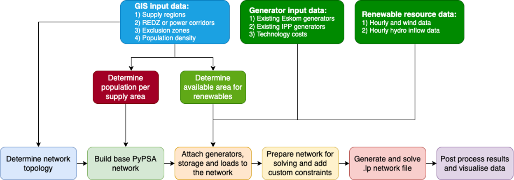
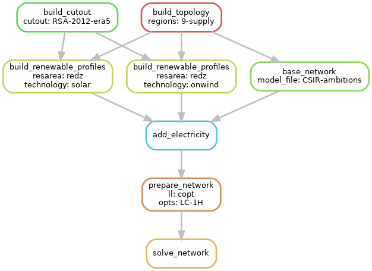

..
  SPDX-FileCopyrightText: 2021 The PyPSA-ZA authors

  SPDX-License-Identifier: CC-BY-4.0

.. _workflow:

##########################################
Workflow
##########################################

Structure
===========

The main workflow structure of PyPSA-ZA is as follows:

**1. Input data**: The input data includes GIS data, generator data, and data on renewable resources. 
The input GIS data is included with the model and may be found in the 'data/bundle/' folder. The generator 
data is loaded into the model through the `model file.xlsx` found in the root directory, which comprises 
information on current Eskom generators, existing Independent Power Producer (IPP) generators, 
and the corresponding technology costs. The model constraints on annual new build limits are also given in `model file.xlsx`.

**2. Populate data**: data is then processed by means of specific methods to derive the
   main input data of the optimization methods, such as renewable energy production, demand, coal fleet EAF etc. 
   Using the tool `Atlite https://github.com/PyPSA/atlite/>`_, renewable energy resource potential is translated 
   into time series for either the `redz` or `corridors` when the option is enabled.

**3. Create network model**: once the necessary model inputs are drawn, then the network model is developed using `PyPSA <https://github.com/PyPSA/PyPSA>`_

**4. Solve network**: execute the optimization for the desired problem, e.g. dispatch, planning, etc.

**5. Summary and plotting**: once the model has been solved, produce nice summaries and plotting

The entire execution of the workflow, from point 1 to point 5, relies on
the automated workflow management tool `Snakemake <https://snakemake.bitbucket.io/>`_ that
iterates the execution of so-called "rules" in an organized way following the input-output chain.

Snakemake
==========

The generation of the model is controlled by the workflow management system `Snakemake <https://snakemake.bitbucket.io/>`_. In a nutshell,
the ``Snakefile`` declares for each python script in the ``scripts`` directory a rule which describes which files the scripts consume and
produce (their corresponding input and output files). The ``snakemake`` tool then runs the scripts in the correct order according to the
rules' input/output dependencies. Moreover, it is able to track, what parts of the workflow have to be regenerated, when a data file or a
script is modified/updated. For example, by executing the following snakemake routine

.. code:: bash

    .../pypsa-za % snakemake -j results/networks/solved_CSIR-ambitions_9-supply_redz_lcopt_LC-1H.nc

the following workflow is automatically executed.

The **blocks** represent the individual rules which are required to create the file ``results/networks/solved_CSIR-ambitions_9-supply_redz_lcopt_LC-1H.nc``.
Each rule requires scripts (e.g. Python) to convert inputs to outputs.
The **arrows** indicate the outputs from preceding rules which a particular rule takes as input data.

.. note::
    For reproducibility purposes, the image can be obtained through
    ``snakemake --dag results/networks/solved_CSIR-ambitions_9-supply_redz_lcopt_LC-1H.nc | dot -Tpng -o workflow.png``
    using `Graphviz <https://graphviz.org/>`_

Customize the scenario excel input file
=======================================

In order to make the PyPSA-ZA model accessible to a larger audience than just developers and users 
who do not know Python, the input data into PyPSA-ZA is entered via an Excel spreadsheet to aid with 
scenario configuration. The excel spreadsheet `model_file.xlsx` is located in the root directory and consists of 
the following sheets:

``model_setup``: Summarizes the capacity from eskom and non-eskom generators, new build limits, projections on annual demand, 
coal fleat Energy Availability Factor (EAF) and reserves(total and fast)

``existing_eskom``: Gives the capacity of conventional and non-conventional Eskom generators, decommissioning rates, 

.. csv-table::
   :header-rows: 1
   :widths: auto
   :class: longtable
   :file: configtables/existing_eskom.csv

``existing_non-eskom``: Gives the capacity of conventional and non-conventional non-eskom generators, decommissioning rates,

.. csv-table::
   :header-rows: 1
   :file: configtables/existing_non_eskom.csv

``new_build_limits``: Gives the `max_installed_limit` and `min_installed_limit` in MW assumed for a scenario for all conventional and non-conventional 
carriers for each year in the planning horizon. A `max_installed_limit` is given as `0`for a given year for a carrier implies that the there is no new 
build for that particilar year for the carrier.

.. csv-table::
   :header-rows: 1
   :file: configtables/new_build_limits.csv

``projected_parameters``:

.. csv-table::
   :header-rows: 1
   :file: configtables/projected_parameters.csv

``costs``: 
